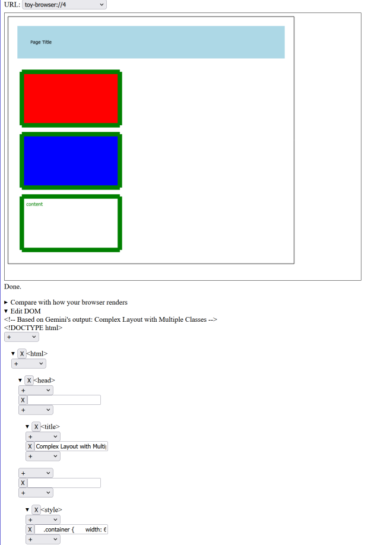

# Toy Browser on Browser

ブラウザーの仕組みを学ぶために実装した、ブラウザー上で動作するブラウザーエンジン + すごく荒削りなDOMエディターのおまけ付き。

## スクリーンショット

## 参考

- [ちいさな Web ブラウザを作ってみよう](https://browserbook.shift-js.info/) シリーズ
- The "Let's build a browser engine!" series:
    - [Let's build a browser engine! Part 4: Style](https://limpet.net/mbrubeck/2014/08/23/toy-layout-engine-4-style.html)
    - [Let's build a browser engine! Part 5: Boxes](https://limpet.net/mbrubeck/2014/09/08/toy-layout-engine-5-boxes.html)
    - [Let's build a browser engine! Part 6: Block layout](https://limpet.net/mbrubeck/2014/09/17/toy-layout-engine-6-block.html)
    - [Let's build a browser engine! Part 7: Painting 101](https://limpet.net/mbrubeck/2014/11/05/toy-layout-engine-7-painting.html)
- [askerry/toy-browser: A toy browser engine](https://github.com/askerry/toy-browser)

## 主に参考にした "Let's build a browser engine!" との違い

- CSSの値における単位は、何を指定していようと暗黙にpxとして解釈される
- textなど、「TODO」としていたレイアウト処理の実装
- `border-style: solid`に対応（`border-style`を指定しなかった場合の挙動が仕様により近い）
- `border-top-color`などに対応

## その他、学習のために盛り込んだ各種要素技術（と主な参考ページ）

- OffscreenCanvas
    - [オフスクリーンキャンバスを使ったJSのマルチスレッド描画 – スムーズなユーザー操作実現の切り札 - ICS MEDIA](https://ics.media/entry/19043/#offscreencanvas%E3%81%AE%E4%BD%BF%E7%94%A8%E6%96%B9%E6%B3%95)
- React
    - <https://ja.react.dev/>
- jotai-optics
    - [Optics — Jotai, primitive and flexible state management for React](https://jotai.org/docs/extensions/optics)
- Canvas
    - [キャンバスのチュートリアル - Web API | MDN](https://developer.mozilla.org/ja/docs/Web/API/Canvas_API/Tutorial)
